# [체크온] AI PostgreSQL 전체 ERD v2 — member-A (v1 17테이블 + v2 증분 6테이블 통합)

원칙(변경 없음): AI PG는 **산출물·실행 메타·캐시**만. 도메인 원본(학생·학습 기록·Alert 상태·문의 원문·Draft 승인)은 백엔드 MySQL 소유 — `…_ref`는 전부 MySQL을 가리키는 **논리 참조**(물리 FK 아님). 전 테이블 `tenant_id` 필수 + RLS.

v2 추가분: `AGENT_RUN` `AGENT_STEP`(LangGraph 에이전트 2종) · `SIGNAL_BRIEF`(ⓐ) · `INQUIRY_CLASS`(ⓑ) · `TAG_SUGGESTION`(ⓒ) · `LABEL_SUGGESTION`(ⓓ)

**(7/15) `AI_RUN` 버전 세트를 6종으로 통일** — `pipeline` · `engine` · `threshold` · `prompt` · `schema` · `contract`. 이 문서와 계약서 §2.2가 각각 4종씩 **서로 다르게** 적고 있었다(이 문서=prompt·schema 포함 / §2.2=threshold·contract 포함). 합집합으로 맞추고 양쪽 문서와 `contracts/execution.py`를 함께 개정했다. `threshold_version`은 감지 임계값 시트(`threshold_config`)의 버전으로 **detection 실행에만 의미가 있어 nullable** — 이 값이 없으면 과거 경보를 재현할 수 없다(CLAUDE.md 불변식 8).

```mermaid
erDiagram
  %% ───────── 실행 메타 (플랫폼) ─────────
  AI_RUN ||--o{ SIGNAL : "감지 실행"
  AI_RUN ||--o{ DRAFT : "생성 실행"
  AI_RUN ||--o{ LLM_CALL : "호출 기록"
  AI_RUN ||--o{ AGENT_RUN : "에이전트 실행(v2)"
  AGENT_RUN ||--o{ AGENT_STEP : "노드·도구 이력(v2)"
  AGENT_STEP |o--o| LLM_CALL : "LLM 노드인 경우"
  LLM_CALL ||--o| LLM_PAYLOAD : "본문(마스킹 전제)"

  %% ───────── detection ─────────
  SIGNAL ||--o{ EVIDENCE_ITEM : "근거 1..*"
  SIGNAL ||--o| SIGNAL_BRIEF : "문장화(v2·ⓐ)"

  %% ───────── composition ─────────
  DRAFT ||--|{ DRAFT_BLOCK : "블록 1..*"
  DRAFT_BLOCK ||--o{ EVIDENCE_ITEM : "블록별 인용"
  DRAFT ||--o{ GATE_RESULT : "게이트 이력"
  DRAFT ||--o{ DRAFT_REVISION : "핑퐁 턴 이력(v2.1)"
  AGENT_RUN ||--o{ DRAFT : "상담팩이 학생별 생성(v2)"

  %% ───────── import_mapping ─────────
  SOURCE_PROFILE ||--o{ MAPPING_SPEC : "양식당 버전들"
  MAPPING_SPEC ||--o{ IMPORT_JOB : "spec으로 N회 수입"
  IMPORT_JOB ||--o{ IMPORT_ROW_ERROR : "오류 행"
  IMPORT_JOB ||--o{ GATE_RESULT : "게이트 이력"
  MAPPING_SPEC |o--o| AGENT_RUN : "조사 에이전트가 산출(v2)"
  MAPPING_SPEC |o--o| LLM_CALL : "1-shot 추론(재사용 시 null)"

  AI_RUN {
    uuid execution_id PK
    varchar tenant_id "teacher alias · RLS 키"
    varchar capability "detection|composition|import_mapping"
    varchar pipeline_version
    varchar engine_version
    varchar threshold_version "감지 임계값 시트 버전 — detection 외에는 null"
    varchar prompt_version "LLM 미사용 시 null"
    varchar schema_version
    varchar contract_version "API 계약 버전 — meta.versions.contract"
    varchar model_provider
    varchar model_name
    jsonb generation_params
    varchar input_snapshot_hash "재현성 키"
    timestamptz created_at
  }
  AGENT_RUN {
    uuid id PK
    uuid run_id FK
    varchar tenant_id
    varchar agent_kind "counsel_pack|mapping_probe"
    jsonb state_checkpoint "LangGraph 체크포인터"
    varchar progress "예: 19/22"
    varchar status "running|paused|done|failed"
    timestamptz updated_at
  }
  AGENT_STEP {
    uuid id PK
    uuid agent_run_id FK
    int seq
    varchar node_name "plan|generate|gate|tool_call…"
    varchar tool_called "get_unique_values… (null 가능)"
    jsonb tool_args_masked "마스킹 통과분만"
    uuid llm_call_id "null 가능"
    varchar outcome
  }
  ENGINE_REGISTRY {
    varchar engine_id PK
    varchar kind "rule|ml(향후)"
    varchar version
    jsonb feature_schema "호환성 검사 메타"
    boolean is_active
  }
  FEATURE_WEEK {
    uuid id PK
    varchar tenant_id
    varchar student_ref "alias"
    date week_start
    varchar segment "normal|readapt|vacation"
    jsonb metrics "acc·time_ratio_norm·submit_rate·type_acc"
    varchar feature_version
    timestamptz created_at "UNIQUE(tenant·student·week·ver)"
  }
  BASELINE {
    uuid id PK
    varchar tenant_id
    varchar student_ref
    varchar segment
    jsonb metrics "이동 기준선"
    int window_weeks
    varchar version
    timestamptz updated_at
  }
  THRESHOLD_CONFIG {
    uuid id PK
    varchar tenant_id
    varchar rule_id "R1..R6"
    jsonb params
    int version "이전 버전 보존"
    varchar source "default|calibrated"
    varchar approved_by "운영자 승인"
    timestamptz created_at
  }
  SIGNAL {
    uuid id PK
    uuid run_id FK
    varchar tenant_id
    varchar student_ref
    varchar rule_id
    varchar signal_type
    varchar display_label "화면 표시 한글 문구(AI 확정) — 09 §1"
    varchar lifecycle "new|ongoing|follow_up — AI 경보 생애 판정, 09 §4"
    numeric score
    int rank "상한 적용 후"
    timestamptz created_at
  }
  SIGNAL_BRIEF {
    uuid id PK
    varchar tenant_id
    uuid signal_ref FK
    text brief_text "LLM 한 줄 문장화"
    boolean gate_passed "왜곡 게이트: 수치·방향·라벨 일치"
    boolean fallback_used "실패 시 템플릿 폴백"
    uuid llm_call_id FK
  }
  RULE_FEEDBACK {
    uuid id PK "예약(7/16 보류) — /feedback 보류로 미적재, 캘리브레이션 재개 시 활성"
    varchar tenant_id
    varchar rule_id
    varchar alert_ref "백엔드 Alert ID(논리)"
    varchar verdict "useful|not_applicable"
    timestamptz created_at
  }
  EVIDENCE_ITEM {
    uuid id PK
    varchar tenant_id
    varchar owner_kind "signal|draft_block"
    uuid owner_id
    varchar source_table "MySQL 논리 참조"
    varchar record_id
    varchar summary "표시용 한 줄"
  }
  DRAFT {
    uuid id PK
    uuid run_id FK
    uuid agent_run_id "상담팩 산출 시(v2·null 가능)"
    varchar tenant_id
    varchar kind "reply|report|counsel_pack"
    varchar student_ref
    varchar guardian_ref
    jsonb label_snapshot "4축 열거형 · 생성 시 동결"
    varchar status "generated|template_only|rejected_insufficient|failed"
    varchar fail_reason
    timestamptz created_at
  }
  DRAFT_BLOCK {
    uuid id PK
    uuid draft_id FK
    int seq
    varchar block_type "greeting|fact|suggestion|closing"
    text content "비었으면 재시도 소진 섹션"
    int regen_count "≤3"
  }
  DRAFT_REVISION {
    uuid id PK
    uuid draft_id FK
    int turn_no "상한 없음 — 턴당 상담 초안 할당 1 소모(월 할당이 자연 상한)"
    varchar scope "whole|block"
    int block_seq "scope=block일 때"
    text instruction "강사 자유 지시 (문체 프로필 재료)"
    varchar preset "softer|conclusion_first|shorter|null"
    jsonb result_blocks "이 턴의 블록 스냅숏 (롤백용)"
    boolean gates_passed "매 턴 게이트 재통과"
    varchar blocked_reason "지시가 게이트에 막힌 경우 사유"
    uuid llm_call_id FK
    timestamptz created_at
  }
  GATE_RESULT {
    uuid id PK
    varchar tenant_id
    varchar owner_kind "draft|import_job"
    uuid owner_id
    varchar gate_name "Consent|DataSufficiency|Evidence|SourceGrounding|ToneSafety|RequiredField|MappingConfidence|TeacherConfirm"
    int seq
    boolean passed
    varchar reason
  }
  INQUIRY_CLASS {
    uuid id PK
    varchar tenant_id
    varchar inquiry_ref "백엔드 문의 ID(논리)"
    varchar topic "grade|schedule|complaint|counsel_request|etc"
    varchar urgency "immediate|normal"
    numeric confidence
    boolean corrected_by_teacher "오분류 수정 이력=평가셋"
    uuid llm_call_id FK
  }
  LABEL_SUGGESTION {
    uuid id PK
    varchar tenant_id
    varchar guardian_ref
    varchar axis "comm|interest|sensitivity|frequency"
    varchar value "축별 열거형만"
    jsonb evidence_quotes "마스킹 인용문 — 실존 게이트 통과분"
    numeric confidence
    varchar status "suggested|confirmed|rejected"
  }
  LLM_CALL {
    uuid id PK
    uuid run_id FK
    varchar role "generator|verifier|mapper|classifier(v2)"
    varchar provider
    varchar model
    varchar prompt_id
    varchar prompt_version
    int tokens_in
    int tokens_out
    numeric cost_usd
    int latency_ms
    varchar outcome "ok|parse_fail|field_missing|bad_ref|timeout"
    timestamptz created_at
  }
  LLM_PAYLOAD {
    uuid call_id PK "FK llm_call"
    text request_masked "redaction 통과본만"
    text response_raw
  }
  STYLE_PROFILE {
    varchar tenant_id PK
    jsonb features "선호 어휘·톤 (수정 diff 누적)"
    timestamptz updated_at
  }
  SOURCE_PROFILE {
    uuid id PK
    varchar tenant_id
    varchar file_hash "멱등키"
    varchar filename
    jsonb sheets "시트·헤더·타입·샘플 통계 · 양식 시그니처"
    timestamptz created_at
  }
  MAPPING_SPEC {
    uuid id PK
    varchar tenant_id
    uuid source_profile_id FK
    int version
    jsonb spec "컬럼매핑·변환규칙·신뢰도·미매핑사유"
    varchar status "inferred|confirmed|rejected"
    uuid inferred_by_call "1-shot 시 · 재사용 시 null"
    uuid probe_agent_run "조사 에이전트 산출 시(v2·null 가능)"
    timestamptz confirmed_at
  }
  IMPORT_JOB {
    uuid id PK
    varchar tenant_id
    uuid spec_id FK
    varchar file_hash
    varchar status "profiled|preview|confirmed|transformed"
    int row_total
    int row_ok
    int row_fail
    timestamptz created_at
  }
  IMPORT_ROW_ERROR {
    uuid id PK
    uuid job_id FK
    int row_no
    varchar column_name
    varchar reason
  }
  TAG_SUGGESTION {
    uuid id PK
    varchar tenant_id
    varchar source_text_hash "과제명 해시 = 캐시 키(재호출 방지)"
    varchar source_kind "trackA_upload|trackB_grading"
    varchar area_tag "수능 기준 개정 제안: reading|literature|speech|writing|language|media (Open-11·A+B 합의)"
    varchar type_tag "fact|infer|critic|concept + item_format(mcq|short|essay) 병행"
    numeric confidence
    varchar status "suggested|confirmed|rejected"
    uuid llm_call_id FK
  }
```

**증분 반영 메모:** ① `DRAFT.agent_run_id` · `MAPPING_SPEC.probe_agent_run` 컬럼 추가(에이전트 산출 연결, 기존 경로는 null) ② `LLM_CALL.role`에 `classifier` 추가(ⓑⓒⓓ) ③ `SOURCE_PROFILE.sheets`에 양식 시그니처 포함(재수입 매칭 키) ④ 양자 승인 대상은 기존과 동일(EVIDENCE_ITEM 구조·LLM_CALL 지표 필드) + `TAG_SUGGESTION`의 area/type enum은 B의 약점 지도와 공용 어휘이므로 **[A+B]** ⑤ **(v2.1) `DRAFT_REVISION` 추가**(핑퐁 턴 이력) · 사용량 미터링은 **일일 턴제**로 확정 — `llm_usage`를 `(tenant_id, date)` 그레인으로 변경: `usage_daily(tenant_id, date PK, interactive_turns int, batch_jobs jsonb)`. 인터랙티브 턴만 일일 한도 대상, 일괄 작업(상담팩·리포트)은 월 단위 작업 카운트(게이팅 소유는 백엔드 Billing — AI는 미터링 리포트만).
