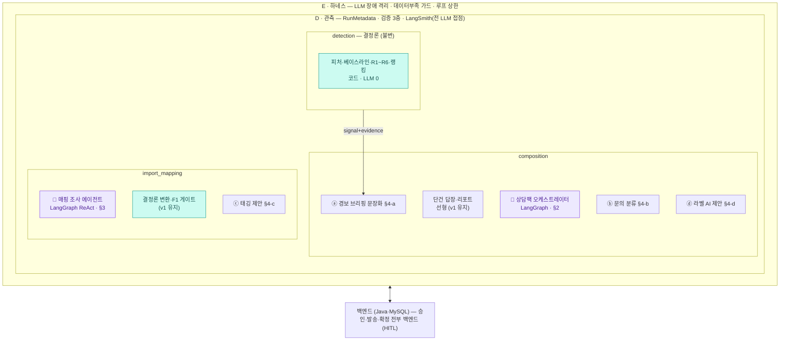
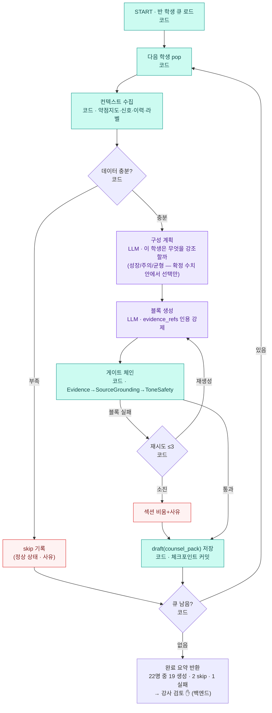
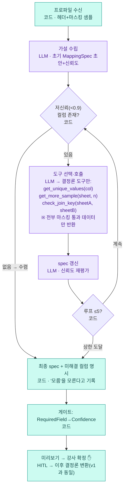

# 03. AI member-A 파이프라인 v2 — 에이전트 2 + 결정론 1 + 보조 AI 4

> **v1 → v2 변경** — v1은 "전부 선형·LLM 2곳"의 최소 구성이었다. v2는 A 파트의 최종 구성을 확정한다:
>
> | 구분 | 구성 요소 | 방식 |
> | --- | --- | --- |
> | 결정론 엔진 | **detection** (신호 감지) | LLM 0 · 순수 함수 — 불변 |
> | 에이전트 ① | **상담팩 오케스트레이터** (composition/counsel_pack) | **LangGraph** 상태 그래프 — 지시서 2.6 예약 승격 |
> | 에이전트 ② | **매핑 조사 에이전트** (import_mapping/inferencer) | **LangGraph** ReAct 도구 루프(상한 5회) |
> | 보조 AI ⓐ | 경보 브리핑 문장화 | 선형 LLM 1콜 + 왜곡 게이트 |
> | 보조 AI ⓑ | 문의 분류 (주제·긴급도) | 선형 LLM 분류 |
> | 보조 AI ⓒ | 태깅 제안 (영역·유형) | 선형 LLM 제안 + 강사 확정 |
> | 보조 AI ⓓ | 라벨 AI 제안 (근거 인용 강제) | 배치 LLM 제안 + 강사 확정 |
>
> 색 규칙 공통 — **보라 = LLM · 청록 = 코드 · 빨강 = 예외 착지.** 참조: v1 문서(기본 파이프라인 3개는 유지), 유스케이스 v1, 설계 v1(ERD).

---

## 0. 프레임워크 판정 갱신

| 프레임워크 | v1 판정 | **v2 판정** | 변경 근거 |
| --- | --- | --- | --- |
| LangGraph | ❌ 지금은 안 씀 | ✅ **2곳 채택** — 상담팩 오케스트레이터 · 매핑 조사 에이전트 | 상담팩 = 지시서 2.6이 예약한 승격 조건(부분 재생성·비동기) 충족. 매핑 조사 = 지시서가 금지한 건 '매핑 **적용**'의 그래프화지 '추론'의 도구 루프가 아님 |
| LangSmith | ✅ 조건부 | ✅ 채택 폭 확대 | LLM 접점이 2곳→7곳(에이전트 2 + 보조 4 + 기존 초안)으로 늘어 trace·프롬프트 회귀의 가치 상승. 조건(마스킹 데이터만·데이터 체류 검토) 동일 |
| GraphRAG / Neo4j | ❌ | ❌ 유지 | 변경 없음 — 검색 코퍼스·대형 그래프 부재 |

**단건 답장·리포트 초안은 여전히 선형이다.** 에이전트화는 "루프·판단·상태가 실제로 필요한 곳"에만 — 이 절제가 설계의 설득력이다.

**⚠ 지시서 개정 안건 (member-B 합의 필요):** ① composition의 counsel_pack 경로를 LangGraph로 승격(2.6 예약 경로 실행) ② import_mapping inferencer를 도구 루프로 확장(마스킹 도구만 접근, 상한 5회) ③ 보조 AI 4종의 소속·계약 추가(contracts에 4개 타입) ④ LLM 호출 증가에 따른 `ModelRole` 확장(classifier 추가 여부). 전부 금지 목록이 아닌 확장 지점이므로 개정 부담은 작다.

---

## 1. 전체 구조 v2



---

## 2. 에이전트 ① — 상담팩 오케스트레이터 (LangGraph)

**왜 에이전트인가.** 상담 주간에 반 전체(22명)의 상담 자료를 만드는 일은 단순 반복이 아니다. 학생마다 데이터 상태가 다르고(신호 있음/없음/데이터 부족), 강조점이 다르고(성장 서사 vs 주의 신호), 라벨별 구성이 다르고, 블록별 게이트 실패가 산발한다. **비동기 일괄 + 부분 재생성 + 중단·재개** — 지시서 2.6이 LangGraph 승격 조건으로 예약한 요구 그 자체다.



- **상태 스키마(요지):** `{queue, current_student, context, plan, blocks[], gate_results[], retry_count, completed[], skipped[], failed[]}` — Pydantic 모델, LangGraph 체크포인터(PostgreSQL)로 매 학생 완료 시 커밋. LLM 장애로 중단돼도 **다음 학생부터 재개**된다.
- **LLM의 재량 범위:** '구성 계획' 노드는 판단을 하지만, **확정된 수치·신호 안에서 강조점을 고르는 판단**이다 — 수치를 만들거나 신호를 뒤집을 수 없다(게이트가 뒤에서 대조). veriθ 식으로 말하면: 코드가 regime을 확정하고 LLM은 내러티브 앵글만 고른다.
- **루프 상한:** 블록 재시도 ≤3(소진 시 섹션 비움), 학생 큐는 유한 — 무한 루프 구조적 불가.

## 3. 에이전트 ② — 매핑 조사 에이전트 (LangGraph ReAct)

**왜 에이전트인가.** 실제 타사 엑셀은 샘플 20행 1-shot 추론으로 안 풀리는 경우가 많다 — 모호한 헤더("점수A"), 시트 간 분리(명단↔성적), 병합 셀. 사람이 하듯 **"들여다보고 → 가설 세우고 → 더 조사하고 → 수렴"**하는 루프가 필요하다.



- **도구는 전부 결정론 코드**이고, 마스킹 레이어 뒤에 있다 — 에이전트가 아무리 조사해도 실명·연락처는 볼 수 없다(구조적 차단).
- **루프 상한 5회.** 소진 시 저신뢰·미매핑을 숨기지 않고 명시한 spec을 낸다 — 어차피 최종 관문은 강사 확정이라, 에이전트의 "모름"이 정직하게 사람에게 넘어간다.
- 조사 과정 전체(도구 호출 시퀀스·중간 가설)가 LangSmith trace + `agent_step` 기록으로 남는다 — 매핑 품질 디버깅의 재료.

---

## 4. 보조 AI 4종 — 미니 파이프라인

공통 패턴: **입력은 코드가 확정 → LLM은 분류/제안/문장화만 → 게이트 또는 강사 확정 → ai_suggested는 자동 적용 금지.**

### ⓐ 경보 브리핑 문장화 (composition · Phase 1)

```
signal+evidence (detection 확정) → LLM: 한 줄 자연어 ("비문학 지문을 붙잡는 시간이 3주째 늘고 있어요 — 정답률은 아직 버티는 중")
→ 왜곡 게이트(코드): 문장 속 수치·방향 == 코드 확정값? 라벨 뒤집기 금지 (R4인데 "성적 급락" 쓰면 차단)
→ 실패 시 템플릿 문장 폴백 (v1 방식) — 브리핑은 절대 비지 않는다
```
veriθ 노드 10과 동일 패턴 + **검증 ③(LLM 라벨 왜곡)**이 그대로 적용된다. detection 코드는 무변경 — 소비 측 기능이다.

### ⓑ 문의 분류 (composition · Phase 1)

```
문의 원문 → LLM 분류: topic(성적|일정|불만|상담요청|기타) + urgency(즉시|일반) + tone(기존 normal|complaint 유지)
→ 구조화 출력(enum 강제 — 자유 텍스트 분류 불가) → 인박스 정렬·완충 강도·할 일 생성 규칙의 입력
→ 오분류 시 강사가 원탭 수정 → 수정 이력이 분류 품질 평가셋으로 축적
```
분류가 틀려도 피해가 "정렬 순서"에 그치도록, 분류 결과는 표시·정렬에만 쓰고 차단·자동 응답에는 쓰지 않는다.

### ⓒ 태깅 제안 (import_mapping · Phase 1)

```
과제명·시험명 텍스트 ("6월 모의고사 비문학 대비 #3") → LLM: AreaTag·TypeTag 제안 + 신뢰도
→ 강사 확정(원탭) 후에만 learning_event 태그로 반영 — ai_suggested 상태로 대기
→ 동일 명명 패턴은 캐시 재사용 (매핑 spec_store와 같은 원리 — 재호출 없음)
```
기획서 H2(입력 부담)를 직접 완화한다. 태그는 detection 피처와 B의 약점 지도가 함께 쓰는 공용 어휘이므로, enum 확정은 [A+B] 양자 승인 대상.

### ⓓ 라벨 AI 제안 (composition · Phase 1.5)

```
소통 이력 5건+ (마스킹·alias) → LLM: 4축 라벨 제안 + 근거 인용 강제
   ("'숫자로 정리해 주세요' 2회 인용 → comm=data 제안, 신뢰도 0.86")
→ 근거 게이트(코드): 인용문이 실제 이력에 실존? → ai_suggested 저장
→ 강사 확정(confirmSuggested) 전에는 초안 생성에 절대 미사용 (기존 원칙 그대로)
```

---

## 5. ERD 증분 (설계 v1 ERD에 추가)

```
agent_run(id PK, run_id FK, agent_kind[counsel_pack|mapping_probe], state_checkpoint jsonb,
          progress "19/22", status[running|paused|done|failed], updated_at)      -- LangGraph 체크포인터
agent_step(id PK, agent_run_id FK, seq, node_name, tool_called, tool_args_masked jsonb,
           llm_call_id FK?, outcome)                                             -- 조사·계획 이력(관측)
signal_brief(id PK, tenant_id, signal_ref FK, text, gate_passed bool,
             fallback_used bool, llm_call_id FK)                                 -- ⓐ
inquiry_class(id PK, tenant_id, inquiry_ref, topic enum, urgency enum,
              confidence, corrected_by_teacher bool, llm_call_id FK)             -- ⓑ
tag_suggestion(id PK, tenant_id, source_text_hash, area_tag, type_tag,
               confidence, status[suggested|confirmed|rejected], llm_call_id FK) -- ⓒ (해시 캐시 키)
label_suggestion(id PK, tenant_id, guardian_ref, axis, value,
                 evidence_quotes jsonb "마스킹 인용", confidence,
                 status[suggested|confirmed|rejected])                           -- ⓓ
```

기존 원칙 유지: 전 테이블 tenant_id+RLS, 도메인 원본은 MySQL, ai_run/llm_call 연결로 재현·비용 추적.

## 6. 검증·테스트 증분

| 대상 | 추가 테스트 |
| --- | --- |
| 에이전트 ① | 상태 전이(LangGraph) · 중단→재개(체크포인트) · 학생별 격리(한 학생 실패가 다음 학생 오염 금지) · 계획 노드가 수치를 못 바꾸는지(적대 케이스) |
| 에이전트 ② | 도구 루프 상한 · 도구가 마스킹 데이터만 반환 · "모름" 명시 경로 · 조사 후 spec 결정론(동일 조사 로그 재적용) |
| ⓐ | 왜곡 게이트(수치·방향·라벨 반전 주입) · 템플릿 폴백 |
| ⓑ | enum 강제 파싱 · 오분류의 피해 반경(정렬만) 계약 테스트 |
| ⓒ | 캐시 히트(재호출 0) · 미확정 태그의 피처 미반영 |
| ⓓ | 인용 실존 게이트 · ai_suggested 미사용 보장(기존) |

## 7. Phase 배치

| Phase | 내용 |
| --- | --- |
| **1 (MVP)** | detection(불변) · 단건 초안(선형+핑퐁) · 매핑 1-shot(v1) · **ⓐ 브리핑 문장화 · ⓑ 문의 분류 · ⓒ 태깅 제안** |
| **1.5** | **에이전트 ① 상담팩**(상담 주간 전까지) · **에이전트 ② 매핑 조사**(1-shot 실패 사례 쌓인 뒤 — 실패 코퍼스가 곧 개발 재료) · ⓓ 라벨 제안 |
| 2+ | **오프라인 시험 루프**(아래) · 예상 후속질문 시뮬레이터 · 음성 메모→개입 기록 — 별도 승인 후 |

**오프라인 시험 루프 (Phase 2 격상 — 기존 '종이 성적표 인식' 후보의 확장):**

```
강사 문제 구상 → LLM과 핑퐁 논의·변형(출제 스튜디오 refine — B 소유, 객관식/서술형/주관식 생성)
 → PDF 출력(기존 MVP 발행 채널) → 수업 중 지면 시험
 → 답안지 스캔/촬영 업로드 → [백엔드: OCR 이름→alias 매칭, Open-12] → OCR 답안 추출(A: import 확장)
 → LLM 1차 채점+해설 초안 (객관식=자동 대조 / 서술형=루브릭 채점 '제안' — B 소유)
 → 강사 검수·보완 ✋ (확정 전 성적 미반영) → learning_event 반영 → 약점 지도·감지·리포트 합류
```

- **단계화:** ⑴ 객관식 마킹(OMR식 — 인식 쉬움) → ⑵ 단답 → ⑶ 서술형 손글씨. 인식 신뢰도 미달 답안은 "판독 불가"로 정직하게 강사에게(매핑 '모름' 명시와 동일 원칙).
- **소유권:** OCR·수집·learning_event 변환 = A(import 확장) / 문항 생성·채점 루브릭·교차 검증 = B(assessment). **A·B 협업 기능 — 지시서 개정 안건에 추가.**
- 기존 원칙 무손상: 채점도 suggested(강사 확정 전 미반영) · 실명은 백엔드에서 alias로 치환 후 진입 · 모든 채점 결과에 근거(문항·루브릭 항목) 부착.

> **최종 한 줄** — A 파트는 "에이전트가 없는 파트"가 아니라, **에이전트 2개(루프·도구·판단이 실제로 필요한 곳)와 결정론 엔진 1개(재현성이 생명인 곳)를 의도적으로 갈라 놓은 파트**다. LLM 접점 7곳 전부에 게이트·근거·HITL이 붙어 있고, detection에는 단 한 곳도 없다 — 이 대비가 설계의 핵심 주장이다.
