# [체크온] AI member-A 파트 설계 v2.1 — 파이프라인 · 시퀀스 · ERD

> **v2 → v2.1 변경** — ① **핑퐁 다듬기**: `/drafts/{id}/refine` 자유 지시 루프 — 1턴 = 상담 초안 할당 1 소모(월 할당이 자연 상한), 매 턴 게이트 재통과, `DRAFT_REVISION` 테이블 추가(§2-B·§3) ② **영역 enum 수능 기준 개정 제안**: 독서·문학·화법·작문·언어·매체 + item_format(객관식/단답/서술형) — A+B 합의(계약 Open-11) ③ **오프라인 시험 루프**(Phase 2, 명세서 F17): OCR 채점은 A의 import 확장 — 답안지 실명→alias 매칭은 백엔드(Open-12) ④ 사용량 = 기능별 플랜 할당(문항/상담/단건 리포트) + 일일 상한 병행(계약 §2.5).
>
> **v1 → v2 변경** — 파이프라인 v2 확정(에이전트 2종 + 보조 AI 4종)을 설계 전체에 반영한다.
> ① §1: 상담팩 오케스트레이터(1-B′)·매핑 조사 에이전트(1-C′)·보조 AI 4종(1-D) 추가 ② §2: 시퀀스 2-E(상담팩 체크포인트·재개)·2-F(조사 도구 루프) 신설, 2-A에 브리핑 문장화(ⓐ) 연결 ③ §3: ERD v2(23테이블 — AGENT_RUN·AGENT_STEP·SIGNAL_BRIEF·INQUIRY_CLASS·TAG_SUGGESTION·LABEL_SUGGESTION 추가) ④ §4·§5 갱신.
>
> **범위** — detection · composition · import_mapping + 플랫폼(evidence · gates · registry · runtime). diagnosis·problem_generation·llm/은 member-B 소유 — 계약(contracts)으로만 등장.
>
> **전제 (v1과 동일)**
> 1. AI 영역은 별도 Python 서비스이고 저장소는 **PostgreSQL**.
> 2. 백엔드(Java·Spring)는 **MySQL**로 도메인 원본(학생·학습 기록·Alert·Draft 승인 상태 등)을 소유.
> 3. 내부 REST 통신 — 백엔드가 **alias 기반 스냅숏**을 넘기고 AI는 산출물을 반환.
> 4. 실명·연락처는 AI 경계를 넘지 않음(에이전트 도구 포함).
> 5. AI PG에는 **AI 산출물·실행 메타·캐시**만 저장(evidence는 MySQL 논리 참조).
>
> **참조** — AI 아키텍처 지시서(개정 안건 4건: 파이프라인 v2 §0 — B 합의 전 에이전트 착수 보류) · 소유권 v1 · R&R v1 · 파이프라인 v2 · 유스케이스 v2

---

## 1. 파이프라인

### 1-A. detection — 결정론 · LLM 금지 (v1 유지)

동일 입력 + 동일 threshold 버전 = 동일 신호(시계·난수 주입 금지). 모든 실행은 `ai_run`(RunMetadata)으로 기록.

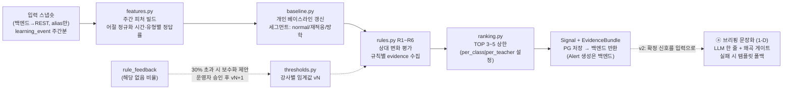

**불변식:** evidence 빈 신호는 `EmptyEvidenceError` · 데이터 2주 미만 제외(관찰 중) · 임계값 변경은 버전으로만. **문장화(ⓐ)는 detection 밖의 소비 기능** — detection 코드는 v2에서도 무변경·LLM 0.

### 1-B. composition (단건 답장·리포트) — 선형 + 재시도 ≤3 (v1 유지)

`pipeline.py`가 단건의 유일한 진입점. 게이트 순서 고정: **Consent → DataSufficiency → (생성) → Evidence → SourceGrounding → ToneSafety**.

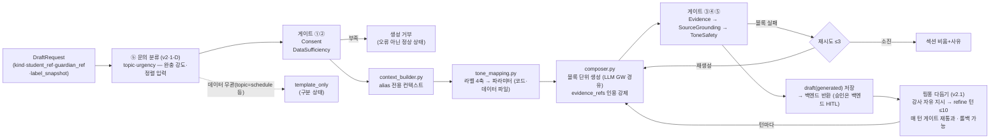

**핑퐁 다듬기(v2.1 확장):** 초안 생성 후 강사가 **자유 문장 지시로 반복 다듬는 대화형 루프**(`/drafts/{id}/refine` — 톤 버튼 3종은 프리셋으로 흡수). 각 턴은 `draft_revision`으로 저장(롤백 가능·미소모)되고 **매 턴 결과가 게이트 ③④⑤를 재통과**한다 — 강사 지시가 게이트를 이기지 못한다("정답률 95%로 써줘"는 근거 부재로 차단+사유 표시). **다듬기 1턴 = 상담 초안 할당 1 소모 — 플랜 월 할당이 자연 상한**(별도 세션 턴 제한 없음), UI는 월 잔여량("이번 달 상담 초안 259/300")을 상시 표시. 지시문·수정 이력은 문체 프로필 재료. ERD: `DRAFT_REVISION`(ERD 전체 v2 참조).

### 1-B′. 상담팩 오케스트레이터 — 에이전트 ① (v2 신설 · LangGraph)

반 전체 일괄 생성: 비동기 + 부분 재생성 + **중단·재개(체크포인트)**. 지시서 2.6 예약 승격 경로.

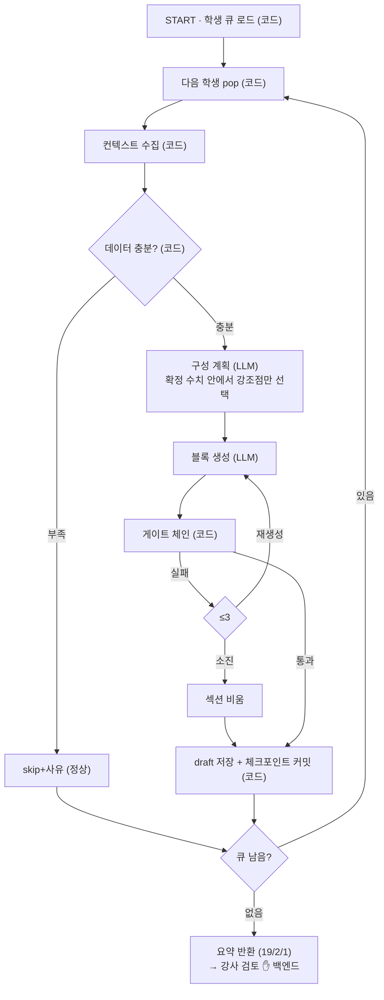

상태 스키마·조건부 엣지·장애 시 `paused`→재개는 파이프라인 v2 §2 참조. 매 학생 완료마다 `agent_run.state_checkpoint` 커밋 — 장애가 나도 완료분은 안전.

### 1-C. import_mapping (1-shot) — LLM=매핑 추론만 (v1 유지)

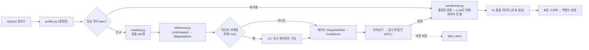

### 1-C′. 매핑 조사 에이전트 — 에이전트 ② (v2 신설 · LangGraph ReAct)

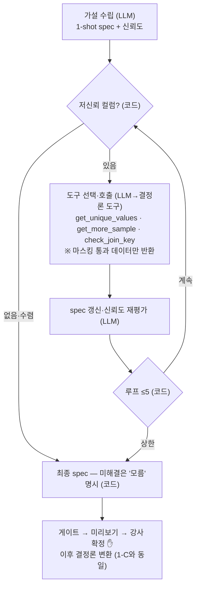

조사와 적용의 분리: 에이전트는 **spec까지만** 만들고, 변환은 v1 그대로 transformer(결정론)가 전담. 전 도구 호출은 `agent_step`+LangSmith trace로 감사 가능.

### 1-D. 보조 AI 4종 (v2 신설 — 상세: 파이프라인 v2 §4)

| | 입력(코드 확정) | LLM 역할 | 게이트/확정 | 산출 테이블 |
| --- | --- | --- | --- | --- |
| ⓐ 브리핑 문장화 | signal+evidence | 한 줄 문장화만 | 왜곡 게이트(수치·방향·라벨 일치) → 실패 시 템플릿 폴백 | SIGNAL_BRIEF |
| ⓑ 문의 분류 | 문의 원문 | topic·urgency 분류(enum 강제) | 표시·정렬에만 사용 — 차단·자동응답 금지 | INQUIRY_CLASS |
| ⓒ 태깅 제안 | 과제명 텍스트(해시 캐시) | AreaTag·TypeTag 제안 | **강사 확정 전 피처 미반영** | TAG_SUGGESTION |
| ⓓ 라벨 제안 | 소통 이력 5건+(마스킹) | 4축 라벨 제안 + **근거 인용 강제** | 인용 실존 게이트 → ai_suggested(초안 미사용) | LABEL_SUGGESTION |

---

## 2. 시퀀스 다이어그램

### 2-A. 야간 감지 배치 + 브리핑 문장화 (v2 갱신)

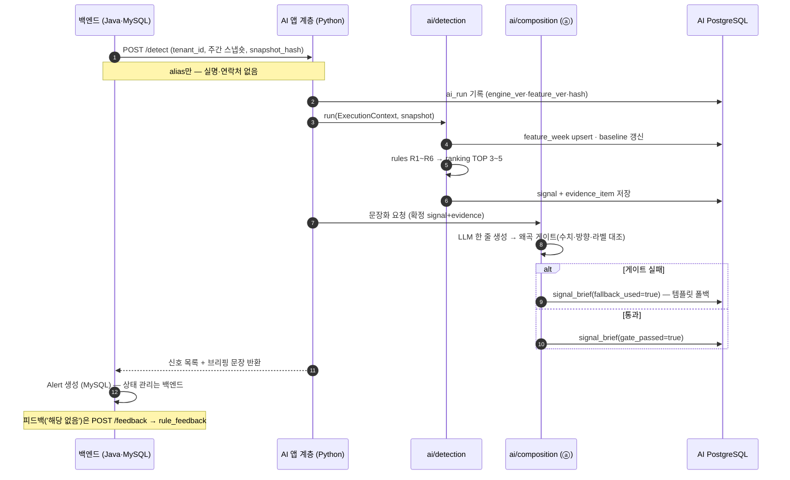

### 2-B. 학부모 답변 초안 — 분류 연결 (v2 갱신)

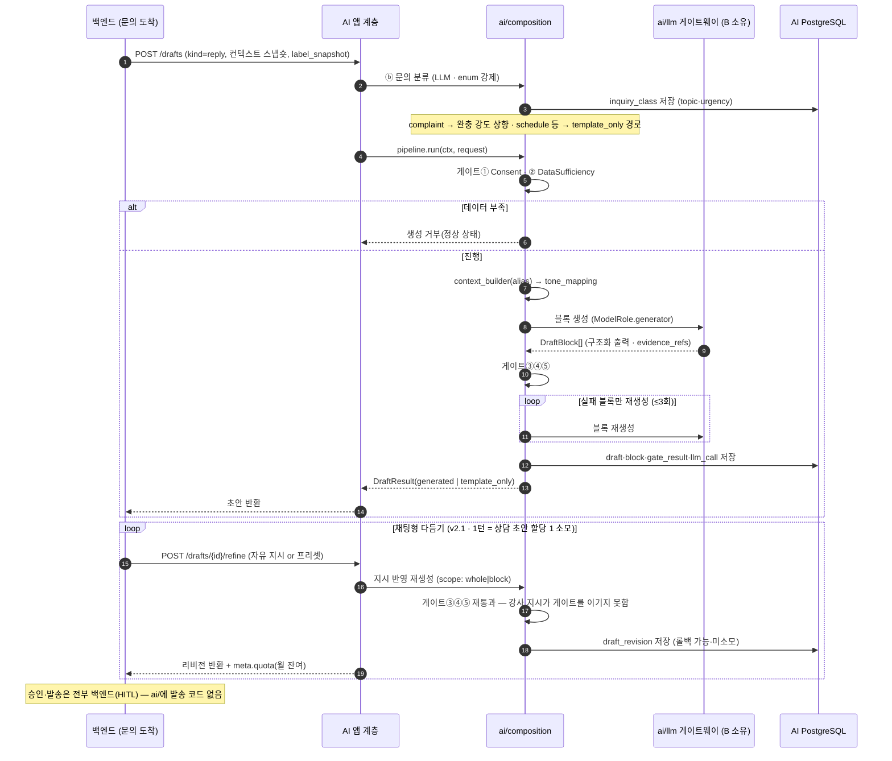

### 2-C. 엑셀 Import — 1-shot (v1 유지, 조사 분기만 표시)

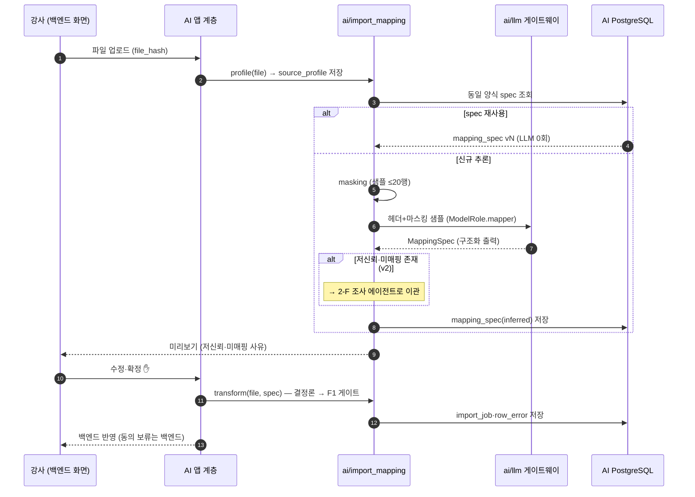

### 2-D. 임계값 캘리브레이션 루프 (v1 유지)

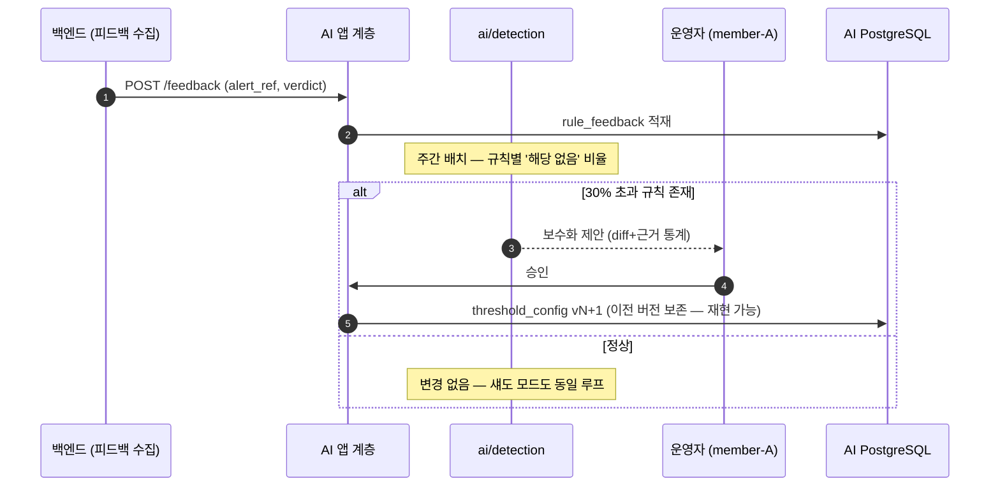

### 2-E. 상담팩 오케스트레이터 — 일괄 생성·중단·재개 (v2 신설)

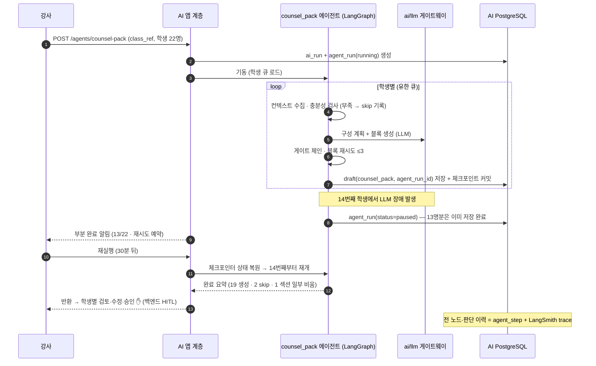

### 2-F. 매핑 조사 에이전트 — 도구 루프 (v2 신설)

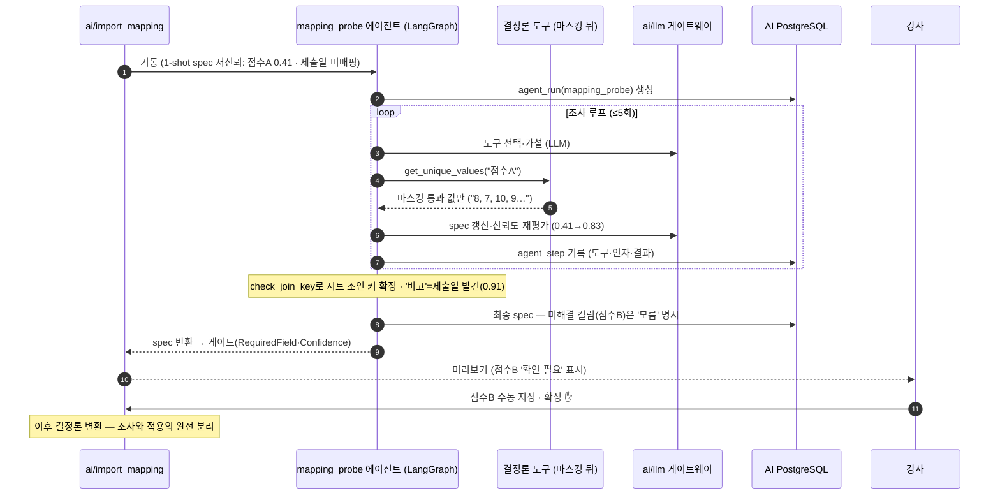

---

## 3. ERD — AI PostgreSQL v2.1 (24테이블 전체)

**원칙(불변):** AI PG는 **산출물·실행 메타·캐시**만. 도메인 원본은 백엔드 MySQL 소유 — `…_ref`는 논리 참조(물리 FK 아님). 전 테이블 `tenant_id` + RLS. (v2.1: `DRAFT_REVISION` 추가 · 사용량 미터링은 `usage_daily(tenant_id, date)` 그레인 — ERD 전체 v2 문서와 동일)

```mermaid
erDiagram
  %% ───────── 실행 메타 (플랫폼) ─────────
  AI_RUN ||--o{ SIGNAL : "감지 실행"
  AI_RUN ||--o{ DRAFT : "생성 실행"
  AI_RUN ||--o{ LLM_CALL : "호출 기록"
  AI_RUN ||--o{ AGENT_RUN : "에이전트 실행(v2)"
  AGENT_RUN ||--o{ AGENT_STEP : "노드·도구 이력(v2)"
  AGENT_STEP |o--o| LLM_CALL : "LLM 노드인 경우"
  LLM_CALL ||--o| LLM_PAYLOAD : "본문(마스킹 전제)"

  %% ───────── detection ─────────
  SIGNAL ||--o{ EVIDENCE_ITEM : "근거 1..*"
  SIGNAL ||--o| SIGNAL_BRIEF : "문장화(v2·ⓐ)"

  %% ───────── composition ─────────
  DRAFT ||--|{ DRAFT_BLOCK : "블록 1..*"
  DRAFT_BLOCK ||--o{ EVIDENCE_ITEM : "블록별 인용"
  DRAFT ||--o{ GATE_RESULT : "게이트 이력"
  DRAFT ||--o{ DRAFT_REVISION : "핑퐁 턴 이력(v2.1)"
  AGENT_RUN ||--o{ DRAFT : "상담팩이 학생별 생성(v2)"

  %% ───────── import_mapping ─────────
  SOURCE_PROFILE ||--o{ MAPPING_SPEC : "양식당 버전들"
  MAPPING_SPEC ||--o{ IMPORT_JOB : "spec으로 N회 수입"
  IMPORT_JOB ||--o{ IMPORT_ROW_ERROR : "오류 행"
  IMPORT_JOB ||--o{ GATE_RESULT : "게이트 이력"
  MAPPING_SPEC |o--o| AGENT_RUN : "조사 에이전트가 산출(v2)"
  MAPPING_SPEC |o--o| LLM_CALL : "1-shot 추론(재사용 시 null)"

  AI_RUN {
    uuid execution_id PK
    varchar tenant_id "teacher alias · RLS 키"
    varchar capability "detection|composition|import_mapping"
    varchar pipeline_version
    varchar engine_version
    varchar prompt_version "LLM 미사용 시 null"
    varchar schema_version
    varchar model_provider
    varchar model_name
    jsonb generation_params
    varchar input_snapshot_hash "재현성 키"
    timestamptz created_at
  }
  AGENT_RUN {
    uuid id PK
    uuid run_id FK
    varchar tenant_id
    varchar agent_kind "counsel_pack|mapping_probe"
    jsonb state_checkpoint "LangGraph 체크포인터"
    varchar progress "예: 19/22"
    varchar status "running|paused|done|failed"
    timestamptz updated_at
  }
  AGENT_STEP {
    uuid id PK
    uuid agent_run_id FK
    int seq
    varchar node_name "plan|generate|gate|tool_call…"
    varchar tool_called "get_unique_values… (null 가능)"
    jsonb tool_args_masked "마스킹 통과분만"
    uuid llm_call_id "null 가능"
    varchar outcome
  }
  ENGINE_REGISTRY {
    varchar engine_id PK
    varchar kind "rule|ml(향후)"
    varchar version
    jsonb feature_schema "호환성 검사 메타"
    boolean is_active
  }
  FEATURE_WEEK {
    uuid id PK
    varchar tenant_id
    varchar student_ref "alias"
    date week_start
    varchar segment "normal|readapt|vacation"
    jsonb metrics "acc·time_ratio_norm·submit_rate·type_acc"
    varchar feature_version
    timestamptz created_at "UNIQUE(tenant·student·week·ver)"
  }
  BASELINE {
    uuid id PK
    varchar tenant_id
    varchar student_ref
    varchar segment
    jsonb metrics "이동 기준선"
    int window_weeks
    varchar version
    timestamptz updated_at
  }
  THRESHOLD_CONFIG {
    uuid id PK
    varchar tenant_id
    varchar rule_id "R1..R6"
    jsonb params
    int version "이전 버전 보존"
    varchar source "default|calibrated"
    varchar approved_by "운영자 승인"
    timestamptz created_at
  }
  SIGNAL {
    uuid id PK
    uuid run_id FK
    varchar tenant_id
    varchar student_ref
    varchar rule_id
    varchar signal_type
    numeric score
    int rank "상한 적용 후"
    timestamptz created_at
  }
  SIGNAL_BRIEF {
    uuid id PK
    varchar tenant_id
    uuid signal_ref FK
    text brief_text "LLM 한 줄 문장화"
    boolean gate_passed "왜곡 게이트: 수치·방향·라벨 일치"
    boolean fallback_used "실패 시 템플릿 폴백"
    uuid llm_call_id FK
  }
  RULE_FEEDBACK {
    uuid id PK
    varchar tenant_id
    varchar rule_id
    varchar alert_ref "백엔드 Alert ID(논리)"
    varchar verdict "useful|not_applicable"
    timestamptz created_at
  }
  EVIDENCE_ITEM {
    uuid id PK
    varchar tenant_id
    varchar owner_kind "signal|draft_block"
    uuid owner_id
    varchar source_table "MySQL 논리 참조"
    varchar record_id
    varchar summary "표시용 한 줄"
  }
  DRAFT {
    uuid id PK
    uuid run_id FK
    uuid agent_run_id "상담팩 산출 시(v2·null 가능)"
    varchar tenant_id
    varchar kind "reply|report|counsel_pack"
    varchar student_ref
    varchar guardian_ref
    jsonb label_snapshot "4축 열거형 · 생성 시 동결"
    varchar status "generated|template_only|rejected_insufficient|failed"
    varchar fail_reason
    timestamptz created_at
  }
  DRAFT_BLOCK {
    uuid id PK
    uuid draft_id FK
    int seq
    varchar block_type "greeting|fact|suggestion|closing|chart_analysis"
    text content "비었으면 재시도 소진 섹션"
    int regen_count "≤3"
  }
  DRAFT_REVISION {
    uuid id PK
    uuid draft_id FK
    int turn_no "상한 없음 — 턴당 상담 초안 할당 1 소모"
    varchar scope "whole|block"
    int block_seq "scope=block일 때"
    text instruction "강사 자유 지시 (문체 프로필 재료)"
    varchar preset "softer|conclusion_first|shorter|null"
    jsonb result_blocks "이 턴의 블록 스냅숏 (롤백용)"
    boolean gates_passed "매 턴 게이트 재통과"
    varchar blocked_reason "지시가 게이트에 막힌 사유"
    uuid llm_call_id FK
    timestamptz created_at
  }
  GATE_RESULT {
    uuid id PK
    varchar tenant_id
    varchar owner_kind "draft|import_job"
    uuid owner_id
    varchar gate_name "Consent|DataSufficiency|Evidence|SourceGrounding|ToneSafety|RequiredField|MappingConfidence|TeacherConfirm"
    int seq
    boolean passed
    varchar reason
  }
  INQUIRY_CLASS {
    uuid id PK
    varchar tenant_id
    varchar inquiry_ref "백엔드 문의 ID(논리)"
    varchar topic "grade|schedule|complaint|counsel_request|etc"
    varchar urgency "immediate|normal"
    numeric confidence
    boolean corrected_by_teacher "오분류 수정 이력=평가셋"
    uuid llm_call_id FK
  }
  LABEL_SUGGESTION {
    uuid id PK
    varchar tenant_id
    varchar guardian_ref
    varchar axis "comm|interest|sensitivity|frequency"
    varchar value "축별 열거형만"
    jsonb evidence_quotes "마스킹 인용문 — 실존 게이트 통과분"
    numeric confidence
    varchar status "suggested|confirmed|rejected"
  }
  LLM_CALL {
    uuid id PK
    uuid run_id FK
    varchar role "generator|verifier|mapper|classifier(v2)"
    varchar provider
    varchar model
    varchar prompt_id
    varchar prompt_version
    int tokens_in
    int tokens_out
    numeric cost_usd
    int latency_ms
    varchar outcome "ok|parse_fail|field_missing|bad_ref|timeout"
    timestamptz created_at
  }
  LLM_PAYLOAD {
    uuid call_id PK "FK llm_call"
    text request_masked "redaction 통과본만"
    text response_raw
  }
  STYLE_PROFILE {
    varchar tenant_id PK
    jsonb features "선호 어휘·톤 (수정 diff 누적)"
    timestamptz updated_at
  }
  SOURCE_PROFILE {
    uuid id PK
    varchar tenant_id
    varchar file_hash "멱등키"
    varchar filename
    jsonb sheets "시트·헤더·타입·샘플 통계 · 양식 시그니처"
    timestamptz created_at
  }
  MAPPING_SPEC {
    uuid id PK
    varchar tenant_id
    uuid source_profile_id FK
    int version
    jsonb spec "컬럼매핑·변환규칙·신뢰도·미매핑사유"
    varchar status "inferred|confirmed|rejected"
    uuid inferred_by_call "1-shot 시 · 재사용 시 null"
    uuid probe_agent_run "조사 에이전트 산출 시(v2·null 가능)"
    timestamptz confirmed_at
  }
  IMPORT_JOB {
    uuid id PK
    varchar tenant_id
    uuid spec_id FK
    varchar file_hash
    varchar status "profiled|preview|confirmed|transformed"
    int row_total
    int row_ok
    int row_fail
    timestamptz created_at
  }
  IMPORT_ROW_ERROR {
    uuid id PK
    uuid job_id FK
    int row_no
    varchar column_name
    varchar reason
  }
  TAG_SUGGESTION {
    uuid id PK
    varchar tenant_id
    varchar source_text_hash "과제명 해시 = 캐시 키(재호출 방지)"
    varchar source_kind "trackA_upload|trackB_grading"
    varchar area_tag "수능 기준 제안: reading|literature|speech|writing|language|media (Open-11)"
    varchar type_tag "fact|infer|critic|concept + item_format(mcq|short|essay)"
    numeric confidence
    varchar status "suggested|confirmed|rejected"
    uuid llm_call_id FK
  }
```

> **양자 승인 대상:** `EVIDENCE_ITEM` 구조 · `LLM_CALL` 지표 필드(기존) + **`TAG_SUGGESTION`의 area/type enum**(B의 약점 지도와 공용 어휘). `ENGINE_REGISTRY`·`THRESHOLD_CONFIG`·`AGENT_*`는 A 단독.

---

## 4. 데이터 경계 — 뭐가 어느 DB에 있나 (v2 갱신)

| 데이터 | 백엔드 MySQL (원본 소유) | AI PostgreSQL (A 소유) |
| --- | --- | --- |
| 학생·학부모·동의 | ✅ 원본 (실명은 vault) | ❌ — alias 참조만 |
| 학습 기록 (learning_event) | ✅ 원본 (append-only) | ❌ — 스냅숏은 페이로드로만, 저장 안 함 |
| 피처·베이스라인·임계값 | ❌ | ✅ FEATURE_WEEK · BASELINE · THRESHOLD_CONFIG |
| 신호 + 브리핑 문장(v2) | Alert 승격·상태 ✅ / 문장 표시 ✅ | SIGNAL + evidence + SIGNAL_BRIEF ✅ |
| 초안 (단건·상담팩) + 핑퐁 리비전(v2.1) | 승인·수정·발송 상태 ✅ (HITL) | DRAFT·BLOCK·GATE_RESULT·**DRAFT_REVISION** + agent_run 연결 ✅ |
| **에이전트 상태·이력(v2)** | ❌ | ✅ AGENT_RUN(체크포인트) · AGENT_STEP(감사) |
| 매핑 스펙·수입 잡 | 변환 결과 반영 ✅ | SOURCE_PROFILE · MAPPING_SPEC · IMPORT_JOB ✅ |
| **분류·제안(v2)** | 문의 원문·라벨 확정 상태 ✅ | INQUIRY_CLASS · TAG_SUGGESTION · LABEL_SUGGESTION ✅ (전부 suggested — 확정은 백엔드) |
| LLM 호출·비용 | ❌ | LLM_CALL · LLM_PAYLOAD ✅ (마스킹 전제) |
| 피드백('해당 없음') | 수집 ✅ | RULE_FEEDBACK 사본 ✅ |

교차 DB FK 없음 — 정합성은 API 계약 + snapshot_hash + 논리 참조 검증으로. AI PG 장애 시 백엔드는 전일 브리핑 유지. **suggested 상태의 모든 산출물(ⓑⓒⓓ)은 백엔드에서 확정되기 전까지 어떤 자동 동작도 일으키지 않는다.**

---

## 5. 다음 작업 후보 (v2.1 갱신)

1. ~~REST 계약서~~ → **✅ 작성 완료: 체크온_AI_API·데이터계약_v0.1.md** (refine·쿼터·benchmarks 포함, Open 안건 12개) — 백엔드 리뷰 미팅으로 v1.0 확정이 다음 단계
2. `threshold_config` 기본값 시트 — R1~R6 파라미터(섀도 모드 절차 포함)
3. AI PG 마이그레이션 초안(Alembic) — **v2.1 24테이블** 기준(DRAFT_REVISION·usage_daily 포함)
4. **LangGraph 체크포인터 설정** — PostgresSaver 연결·state 스키마(Pydantic)·재개 시나리오 통합 테스트(유스케이스 C5·I2 대응)
5. **지시서 개정안 정리 → member-B 합의** — 기존 4건(파이프라인 v2 §0) + **영역 enum 수능 개정(Open-11)** + **오프라인 시험 루프 A·B 분담(F17)**. 합의 전 에이전트 2종 착수 보류, 보조 ⓐⓑⓒ는 선행 가능
6. 체크온 표준 스키마 정의서 — Import(F1b)의 변환 목적지(백엔드 리뷰 미팅의 Open-3b와 함께 확정)

> 본 문서가 AI 아키텍처 지시서·소유권 v1과 충돌하면 **지시서가 우선**한다.
