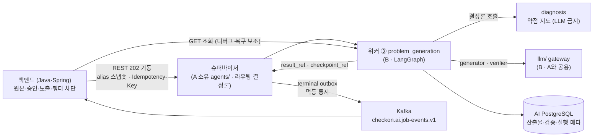
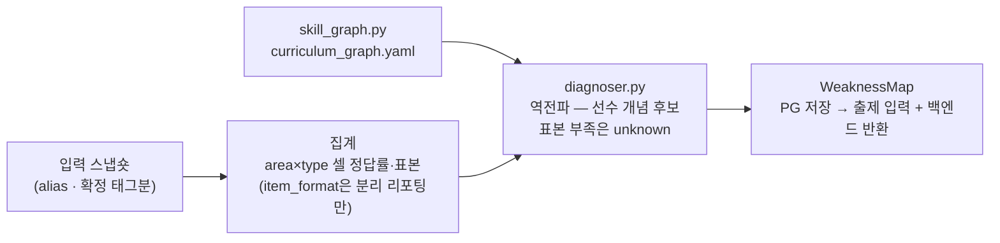
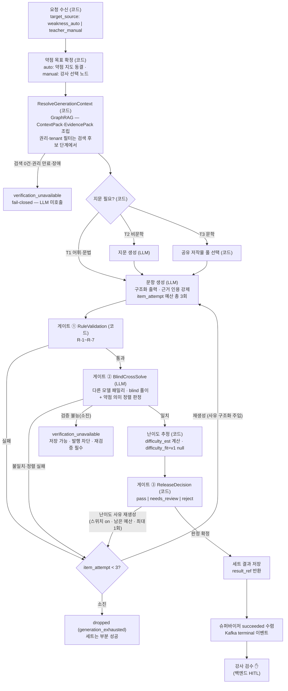
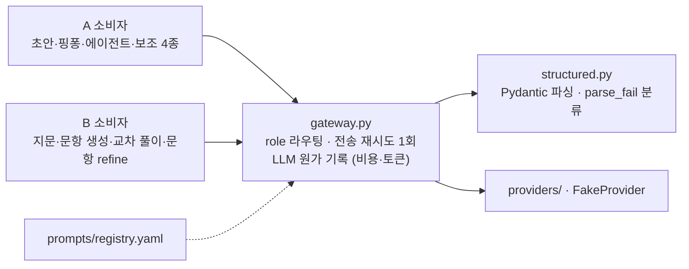

# [체크온] AI member-B 파이프라인 v1.2 — 결정론 진단 1 + 출제 워크플로 1 + 플랫폼 llm/

> **지위:** member-B(염준영) 공식 파이프라인 v1.2. part_a/01_pipeline과 대칭인 B의 전체 구조 문서 — 상세 시퀀스·ERD는 [`02_design.md`](02_design.md), 도메인 규격은 04~07.
>
> **변경 이력**
> - v1.3 (2026-07-30): §5 LangSmith 마스킹 경계를 **LLM gateway 앞단 `(b)` 훅**과 **LangGraph 노드·체크포인터 경계**로 분리했다. 전자는 `llm/`(B), 후자는 `agents/`(A) 소유이며 실제 LangSmith 효과 대상은 [`09`](09_integration_proposals.md) §2-16에서 재활성화 전에 실측 확정한다.
> - v1.2 (2026-07-27): **GraphRAG 지식 계층 채택**([`11`](11_graphrag_knowledge_layer.md)) — §0 판정표에 플랫폼 계층으로 추가(에이전트 아님·LLM 금지·판정 권한 없음), §3 출제 흐름에 `ResolveGenerationContext` 선행 단계 삽입, §7 Phase 배치에 GraphRAG P0-1~P1-5 반영. 계약(`ContextPack`·`EvidencePack`·`GraphContextService`)은 문제 생성 LangGraph보다 **앞선다**. 공용 계약을 건드리는 2건(`VersionSet` 3필드·evidence resolver)은 [`09`](09_integration_proposals.md) §2-12 제안으로 분리했다.
> - v1.2 (2026-07-27): B-M2-02 확정 반영 — 난이도 추정을 게이트 ③ 앞으로 이동하고, 난이도 사유 재생성도 문항당 총 3회 공통 예산 안에서 1회만 허용.
> - v1.1 (2026-07-27): 슈퍼바이저 실행 계약 확정 — 영속 WorkerJob 정본, `problem_set.generate`·`problem_item.refine`·`problem_item.reverify` operation 분리, 강제 선점 금지·문항 경계 협력적 양보, 실행 phase와 문제생성 결과 status 분리.
> - v1 (2026-07-15): 구 `01_design.md` §1을 분리·증보. 7/15 결정 반영 — ① B-1 승인: **슈퍼바이저 1 + 워커 3**(문제 생성 = B 워커) ② v1 문항 형식 **mcq만** ③ 완료 통지 **Kafka** ④ AI는 쿼터 무관(meta.quota 폐기) ⑤ B-4(서술형 분담) 폐기 ⑥ 수능 고등 타겟. 대화 결정 반영 — 재시도 총 3회 · 약점 의미 정렬 판정 · 수동 목표 출제 허용 · 핑퐁 수정 MVP 승격.
>
> **전제** — AI는 별도 Python 서비스(AI PostgreSQL), 백엔드(Java·MySQL)가 도메인 원본·승인·노출 소유, 입력은 alias 스냅숏만(실명·연락처는 경계 통과 금지), 쿼터는 전부 백엔드 Billing(AI는 알지 못함). 소스 루트 `src/ai/` — 구조 재편 금지(`docs/02_ownership.md`).

---

## 0. 프레임워크 판정 — 무엇이 에이전트이고 무엇이 아닌가

| 조각 | 형태 | 판정 근거 |
| --- | --- | --- |
| diagnosis(약점 진단) | **결정론 함수 — 에이전트 아님, LLM 금지** | 동일 입력+동일 그래프 버전=동일 결과. 루프·재량·상태가 없다 |
| problem_generation(출제) | **LangGraph 워크플로 — B-1 승인 워커 ③** | 문항 루프·재시도·체크포인트가 실제로 필요한 곳 |
| 3단계 품질 게이트 | 워크플로 내부 노드(자체 실행) | 순서·재시도 의미가 A 게이트 체인과 달라 `gates/chain.py` 미사용 — `GateResult` 공용 타입만 사용 |
| llm/ 게이트웨이 | 플랫폼(B 소유, A·B 공용 소비) | 모든 LLM 호출의 단일 경유지 |
| **GraphRAG 지식 계층** | **플랫폼 — 에이전트 아님, LLM 금지** | query plan은 결정론 코드가 만든다. 근거를 찾아 `ContextPack`을 조립할 뿐 **판정·승인·발행 권한이 없다**([`11`](11_graphrag_knowledge_layer.md) §3·§6) |

**7/15 B-1 확정 · 7/27 실행 계약 확정:** 에이전트 구조는 **슈퍼바이저 1 + 워커 3** — counsel_pack(A) · mapping_probe(A) · **problem_generation(B)**. 슈퍼바이저는 영속 Job의 lease·결정론 라우팅·실행 phase·terminal 이벤트만 관리한다(LLM 0회, 워커 산출물 불변) — `docs/policies/langgraph_state.md` §5. B 워커의 Job 단위는 operation별로 **문항 세트 1건** 또는 **문항 리비전·재검증 1건**이다(§6).

## 1. 전체 구조 v1

- 기동은 REST 202(멱등키 즉시 검증 필요), **완료 통지는 Kafka**(7/15 Open-2 — 폴링 제거, GET은 보조). 워커는 terminal 이벤트를 직접 발행하지 않는다. 슈퍼바이저 Job 저장소가 terminal phase 전이와 outbox 기록을 같은 트랜잭션에서 확정하고, 재전송 시 같은 `event_id`를 사용한다.
- 강사 대면 흐름(출제 스튜디오): Step 1 대상·약점 확인(진단) → Step 2 조건 설정·생성 → Step 3 검증 라벨·선별·핑퐁 수정 → Step 4 승인·발행(백엔드 HITL). Step 3 상세는 [`07_refine_policy.md`](07_refine_policy.md), 시나리오는 [`03_usecases.md`](03_usecases.md).

## 2. diagnosis — 약점 진단 · 결정론 · **LLM 금지**

동일 입력+동일 그래프 버전=동일 약점 지도(바이트 동일). 시계·난수 주입 금지, 모든 실행 `AI_RUN` 기록. 규격은 [`04_curriculum_graph.md`](04_curriculum_graph.md).

**불변식:** ① area 어휘와 B-3 측정 대상 경계는 `contracts/taxonomy.py`·`policies/taxonomy.md`만(6영역·경계 7건 확정) ② `cell_min_items` 미만 셀은 `unknown`(억지 진단 금지) ③ 미확정 태그(ai_suggested) 집계 미반영 ④ 그래프 개정은 `graph_version`으로만 ⑤ `suspect`는 확정 약점으로 사용 금지 — 탐색 출제만.

**데이터 부족 분기(확정):** 진단 표본이 기준 미달이면 자동 개인화 출제는 `rejected_insufficient`(200 + 정상 상태)로 종료. 단 **강사가 영역·노드를 직접 선택한 수동 목표 출제는 허용** — 결과 메타와 화면에 "약점 데이터 기반 개인화 아님"을 필수 표기(`target_source=teacher_manual`, [`05_problem_generation.md`](05_problem_generation.md) §4.1).

## 3. problem_generation — 출제 워크플로 (LangGraph 워커 ③)

진단 조회→생성→게이트 ①②→난이도 추정→게이트 ③이 한 그래프에서 닫힌다. LLM 접점은 생성·교차 풀이 2곳. v1 문항 형식은 **mcq만**(7/15 — short·essay는 enum 예약).

**불변식:** ① 문항 1개 실패가 세트를 멈추지 않는다(부분 성공) — 단 dropped 비율·검증 장애 연속이 임계를 넘으면 **조기 중단** 후 `partial_success`([`06_quality_gates.md`](06_quality_gates.md) §6) ② 모든 rationale은 EvidenceRef 근거 동반 ③ 교차 풀이는 blind(정답·해설·근거 비공개 — 목표 메타는 제공) ④ LLM 산출물은 suggested — 게이트+강사 승인 전 자동 적용·학생 노출 금지 ⑤ **문항당 시도 예산은 하나** — 생성·정렬 실패·규칙 실패·교차 불일치·난이도 불일치가 전부 같은 `item_attempt`(총 3회)를 소모, 검사별 중첩 루프와 네 번째 호출 금지.

**약점 정렬 3층 확인(확정):** ⑴ 코드 R-7 — 요청 태그·`skill_node_id`와 산출 메타 정합 ⑵ 게이트 ② — verifier가 "이 문항이 목표 약점을 측정하는가"를 구조화 판정(`aligned`·`alignment_confidence`) ⑶ 강사 — Step 3에서 약점·문항·근거를 함께 확인. 같은 검사를 반복하는 게 아니라 **책임자가 다른 3층**이다.

**실행·결과 분리:** `rejected_insufficient`, 세트 `partial_success`·도메인 `failed`, 문항 `verification_unavailable`·`dropped`는 문제생성 결과 계약이다. 조기 중단 시에도 `requested_count = processed_count + unstarted_count`를 보존해 미처리 문항이 사라지지 않는다. 워커가 해당 결과와 `result_ref`를 정상 저장했다면 공통 Job phase는 `succeeded`다. 결과를 확정하지 못한 인프라·체크포인트 장애만 Job `failed`로 수렴한다.

**체크포인트·v1 실행 순서:** 세트 생성은 문항을 순차 처리하고 문항 1개 완료마다 커밋한다. 세트 내 중복 판정·공통 재시도 예산·조기 중단이 순서에 의존하므로 v1에서 문항 병렬 생성은 금지한다. 중단 시 다음 미완료 문항부터 멱등 재개한다. 직렬화·재개는 `docs/policies/langgraph_state.md` §3 준용(저장 전 redaction·`state_schema_version`). 공통 `worker_kind=problem_generation`·Job 계약과 PostgresSaver 연결 경계는 반영됐으며, B 워커 그래프는 이 계약을 소비해 문항 경계 recorder를 연결한다.

## 4. 난이도 보정 루프 — A 임계값 캘리브레이션과 대칭

제출 실측 vs 추정 대조(코드) → 괴리 시 보정 제안 → 운영자 승인 ✋ → `difficulty_calib` vN+1(이전 버전 보존). 초기값·가중치는 [`06_quality_gates.md`](06_quality_gates.md) 부록 'B 기본값 시트'. 파일럿 첫 2주는 섀도 대조만.

## 5. llm/ — 플랫폼 (B 소유 · A 소비자가 더 많음)

- **모든 LLM 호출은 gateway 경유** — 예외 없음. `ModelRole = generator | verifier | mapper | classifier | narrator`(narrator는 브리핑 문장화 전용 — `[2026-07-28 A 신설]`, [`09`](09_integration_proposals.md) §1-10). **verifier는 generator와 다른 모델 패밀리 강제**(라우팅 수준 보장, 호출자 우회 불가).
  - 이 규칙은 A·B 공용이나 현재 B 문서에만 있어 B 규율로 읽힌다 — `docs/03_coding_rules.md` 승격을 요청했다([`09`](09_integration_proposals.md) §1-9 A-10).
- **전송 재시도는 role별 주입** `[2026-07-28 구현]` — `LlmGateway(..., transport_retry: Mapping[ModelRole, int])`, 값 범위 `0..1`(벗어나면 기동 실패), 미지정 role 기본 1회. 게이트웨이는 `verify_config`를 모르며 값은 **조립부가 주입**한다(계산·I/O 분리). B role 값의 단일 원천은 [`06`](06_quality_gates.md) 부록 `transport_retry`다.
- 재시도 2층 분리: **생성 재시도**(item_attempt — 워크플로 소유)와 **전송 재시도**(논리 콜당 1회 — gateway 소유). 최악 계산은 06 §4.
- 쿼터 무관(7/15) — gateway는 **LLM 원가 관측만**(비용·토큰, ARPU 20% 검증용 — `quota_metering.md` §5). 차단·카운트·잔여는 전부 백엔드.
- LangSmith 도입 확정(B-6) — 트레이스는 마스킹 통과분만(게이트웨이 앞단 훅).
  - **LLM gateway 앞단 `(b)` 훅:** provider 요청 트레이스의 주입 경계. `llm/`(B) 소유.
  - **LangGraph 노드·체크포인터 경계:** 노드 state 전체와 checkpoint serde의 별도 경계. `agents/`(A) 소유. gateway 훅만으로 덮을 수 없으며 재활성화 조건은 [`09`](09_integration_proposals.md) §2-16을 따른다.

## 6. 슈퍼바이저-워커 연동 `[A+B 확정 7/27]`

| 항목 | 확정 계약 |
| --- | --- |
| 라우팅 | 요청 1건 → Job 1건 → `problem_generation` 워커 1종. 다른 워커와 결과 fan-in하지 않음 |
| 세트 생성 | `problem_set.generate` — Job 단위는 문항 세트 1건, 체크포인트·양보 경계는 문항 1개 완료 |
| 문항 수정 | `problem_item.refine` — Job 단위는 문항 리비전 1건, 전체 재검증을 포함 |
| 문항 재검증 | `problem_item.reverify` — Job 단위는 문항 1건 |
| 우선순위 | refine·reverify=`interactive`, 세트 생성=`standard`. 실행 중 강제 선점은 금지하고 문항 체크포인트 경계에서만 협력적으로 `paused` 양보 |
| 기아 방지 | 같은 우선순위는 `queued_at → job_id` 순서, 오래 대기한 배치는 aging 적용 |
| 결과 수렴 | 워커는 도메인 결과와 `result_ref`를 저장. 슈퍼바이저는 내용을 병합하지 않고 공통 phase와 terminal 이벤트만 확정 |
| 소유 | 슈퍼바이저 구현은 `agents/`(A), problem_generation 그래프·adapter는 B, 공통 Job·operation·라우팅 계약은 양자 승인 |

## 7. Phase 배치

| Phase | 내용 |
| --- | --- |
| **P0 (선결)** | **GraphRAG 계약** — Graph 도메인·버전(P0-1) · 권리 확인 콘텐츠 파이프라인(P0-2) · `ContextPack`/`EvidencePack`(P0-3) · `GraphContextService` 인터페이스(P0-4). **문제 생성 LangGraph보다 앞선다** — 계약 없이 워크플로를 짜면 전량 재작성([`11`](11_graphrag_knowledge_layer.md) §10) |
| **P1 (MVP)** | T1 어휘·문법 mcq 생성 + 3단계 게이트 + 약점 정렬 + **문항 핑퐁 수정·교체·삭제·롤백·직접 수정**(확정 — Step 3가 협업형 편집 단계이므로) + Kafka 완료 통지. **T1은 사전·규칙 ID 직접 조회라 벡터 검색 백엔드 없이 완주 가능** — 계약은 선행, 검색 백엔드는 후행 |
| P1 후반 | T2 비문학(지문 생성 — 사실성 fail-closed 선결: D-04) |
| P1.5~2 | T3 문학(공유 저작물 풀 — 풀 등재 선결) |
| P2 | F17 시험지 PDF 조판(`print_layout.py`) · OCR 소유는 Open-12와 재론 |
| 예약(고도화) | `short`·`essay` 문항(내신·자체 시험 타겟 확장 시) · 중등(v1 코드 분기 금지 — 7/15) |

> 미확정 항목 총괄과 공용 변경 제안은 [`09_integration_proposals.md`](09_integration_proposals.md).
