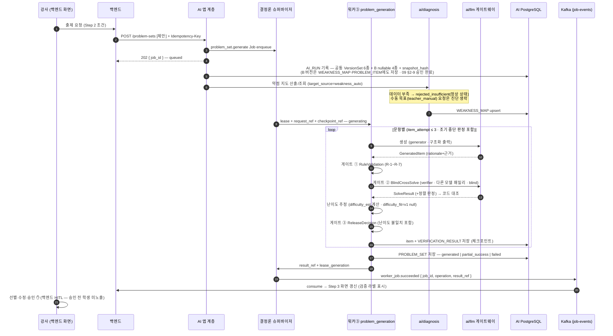
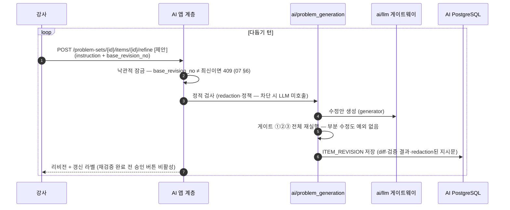
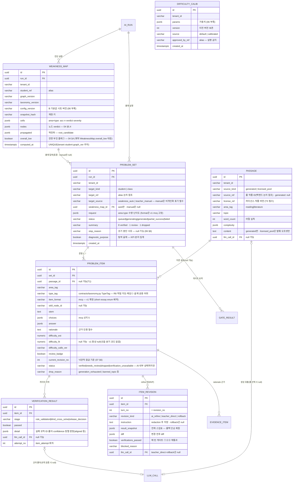

# [체크온] AI member-B 파트 설계 v1 — 시퀀스 · B 증분 ERD · 데이터 경계

> **지위:** member-B(염준영) 공식 설계 v1. 전체 파이프라인은 [`01_pipeline.md`](01_pipeline.md), 본 문서는 시퀀스·ERD·데이터 경계. 우선순위: 공용 계약 > 02_ownership > 99_open_items > part_a > 본 문서.
>
> **변경 이력**
> - v1.2 (2026-07-30): `PROBLEM_ITEM.type_tag`를 값 복제 대신 `contracts/taxonomy.py`의 공용 `TypeTag` 참조로 정합. 어휘 변경 시 감지 R6·약점 지도·태깅ⓒ·출제를 같은 변경 단위로 재산정한다.
> - v1.1 (2026-07-27): B-M2-01 확정 반영 — `PROBLEM_ITEM`의 문항 자체 난이도(`difficulty_est`)와 학생 적합도(`difficulty_fit`)를 분리하고, v1의 `difficulty_fit`은 항상 null로 고정. **계약↔ERD 간극 2건 해소**: `WEAKNESS_MAP.overall_low` 컬럼 신설(`contracts/diagnosis.py`의 `WeaknessMap.overall_low`가 산출물에 존재하나 ERD에 컬럼이 없던 문제), `PROBLEM_SET.request`의 "난이도" 표기를 신설 필드 `requested_difficulty`([`05`](05_problem_generation.md) §4.1 C6)에 정합. 공용 ERD 편입 스펙은 [`09`](09_integration_proposals.md) §2-4.3.
> - v1 (2026-07-15): 구 `01_design.md`에서 파이프라인 절을 [`01_pipeline.md`](01_pipeline.md)로 분리하고 본 문서로 개편. 7/15·대화 결정 반영 — Kafka 완료 통지, meta.quota 폐기, v1 mcq만, B-4 폐기(서술형 v1 제외), 핑퐁 수정 MVP 승격, 수동 목표 출제(`target_source`), 낙관적 잠금. 입력 초안: `CODEXPROMPT/(염준영)_파트_설계_v0.md` · `CODEXPROMPT/(염준영)_출제스튜디오_Step3_검증라벨_핑퐁수정_요구사항_v0.md`.

---

## 1. 시퀀스 다이어그램

### 1-A. 맞춤 문항 세트 생성 — 진단→생성→3단계 품질 게이트→검수

API 경로는 정본 계약에 아직 없다 — 아래 경로는 `[제안]`([`09_integration_proposals.md`](09_integration_proposals.md) §2-1). 공통 규약(공용 envelope·`X-Tenant-Id`/`X-Request-Id`/`Idempotency-Key`·202)은 준수하고, **완료 통지는 Kafka**(7/15 — GET은 디버그·복구 보조).

### 1-B. 문항별 핑퐁 수정(refine — **MVP**)

정책 전문은 [`07_refine_policy.md`](07_refine_policy.md) — 여기는 골격만. **강사 지시가 게이트를 이기지 못한다.** 쿼터는 백엔드 소유(AI 무관 — 7/15).

### 1-C. 승인·발행 이후 (참고 — 전부 백엔드 소유)

강사 승인(Step 4) → 발행(PDF/학생 홈) → 학생 풀이 → `learning_event` 유입 → 다음 진단에 반영. AI는 이 경로에 개입하지 않는다(발송 코드 없음). 승인된 문항의 재수정 시 승인 상태 철회 절차는 `OPEN`(백엔드 소유 — 09 §3).

> 서술형 채점 분담(구 B-4)은 **7/15 폐기** — v1은 mcq만이라 서술형 자체가 없다. F17 지면 시험·OCR 소유는 P2 시점에 Open-12와 함께 재론.

## 2. ERD 증보 — AI PostgreSQL (B 소유 테이블 **7종**)

**원칙(`docs/06_erd.md`와 동일):** 산출물·실행 메타·캐시만. `…_ref`는 논리 참조. 전 테이블 `tenant_id`+RLS. 공용 테이블(AI_RUN·LLM_CALL·GATE_RESULT·EVIDENCE_ITEM)은 현재 애플리케이션 정본 26테이블을 재사용한다. 아래 B 전용 7테이블의 공용 ERD 편입은 별도 승인 요청(09 §2-4)이다.

> **공용 enum 확장(09 §2-3):** `GATE_RESULT.owner_kind` += `problem_set` · `GATE_RESULT.gate_name` += `RuleValidation|BlindCrossSolve|ReleaseDecision` — ✅ **A+B 승인·`d5283d0` 구현·공용 ERD 문서 동기화 완료**. 잔여: `EVIDENCE_ITEM.owner_kind` += `problem_item`만 `evidence/models.py` 구현 시 양자 승인.

## 3. 데이터 경계 — 뭐가 어느 DB에 있나

| 데이터 | 백엔드 MySQL (원본) | AI PostgreSQL (B 소유분) |
| --- | --- | --- |
| 문항 승인·배포·학생 노출 상태 | ✅ HITL 전부 | ❌ — status는 AI 내부 검증 상태까지만 |
| 쿼터(차단·카운트·잔여 표시) | ✅ Billing 전부 (7/15) | ❌ — **AI는 쿼터를 알지 못한다** |
| 학생 제출·채점 결과(learning_event) | ✅ 원본 | ❌ — 스냅숏 페이로드로만, 저장 안 함 |
| 약점 지도 | 표시용 사본 ✅ | WEAKNESS_MAP ✅ (산출 원본) |
| 지문·문항·검증·리비전 | 승인 확정본 ✅ | PASSAGE·PROBLEM_SET·PROBLEM_ITEM·VERIFICATION_RESULT·ITEM_REVISION ✅ |
| 난이도 파라미터 | ❌ | DIFFICULTY_CALIB ✅ |
| 공유 저작물 풀(문학) | 라이선스·원문 ✅ | 풀 ID·발췌 오프셋 참조만 |
| LLM 호출·원가 | ❌ | LLM_CALL·LLM_PAYLOAD ✅ — **원가 관측용**(쿼터 아님, quota_metering §5) |

**suggested/verified 상태의 모든 문항은 강사 승인 전까지 학생에게 어떤 경로로도 노출되지 않는다.** `verification_unavailable` 문항은 재검증 성공 전까지 승인 대상에도 오르지 않으며 **수동 예외 승인 불허**(확정 — [`06_quality_gates.md`](06_quality_gates.md) §3).

## 4. OPEN 항목 (본 문서 관련분 — 총괄은 09 §3)

| 번호 | 항목 | 담당 |
| --- | --- | --- |
| B-3 잔여 | taxonomy 경계 사례 7건 판정 (enum 자체는 7/15 확정) | A+B |
| Open-12 | F17 OCR 실명→alias·OCR 소유 (P2) | BE(+A·B) |
| — | 승인된 문항 재수정 시 승인 철회 절차 | BE |
| — | 리비전 보존 기간(개수는 무제한 `[잠정]`) | BE+B |
| D-10 | B API 계약 편입 + Kafka 이벤트 증분 | BE+B |

## 5. 다음 작업 후보

- ✅ 완료: `contracts/diagnosis.py`·`contracts/problem_generation.py` 계약 및 테스트 구현(`d5283d0`)
1. **문법 DAG `curriculum_graph.yaml` 25~40노드 실작성**
2. `golden/problems/`·`golden/diagnosis/` 실파일화(08 §1) — CI 게이트가 구현보다 먼저
3. `pg_banned_topics.yaml` + B 기본값 시트(`verify_config` v1) 실파일화
4. ✅ 슈퍼바이저 실행 계약(langgraph_state §5) B 리뷰 완료 — [`01_pipeline.md`](01_pipeline.md) §6
5. B API 증분 + 공통 `worker_job.*`의 `result_ref` 조회 방식 BE 리뷰(D-10) — 09 §2-1
6. T1 기준 자료 후보 조사(D-03) — 데이터 자산 검증 우선
